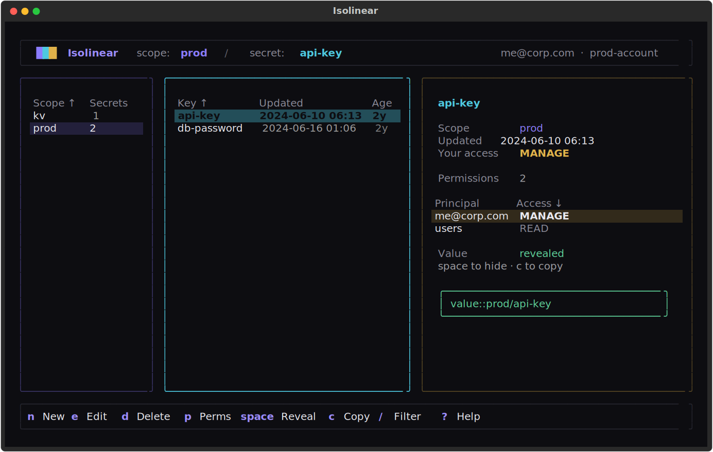
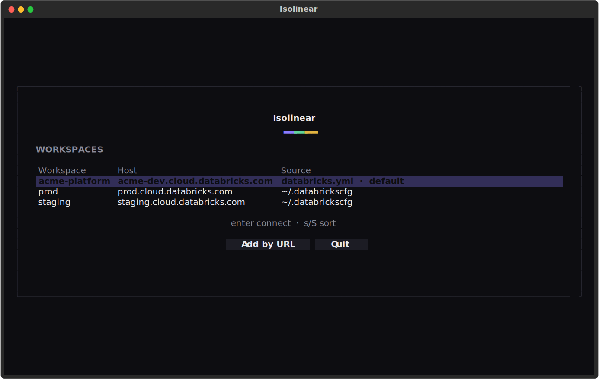
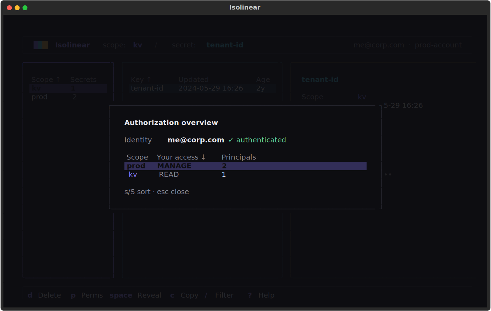

# Isolinear ▦

**A keyboard-driven terminal UI for managing Databricks secrets.**
Browse scopes, secrets and ACLs; create / edit / delete; reveal & copy
values — all from a fast, calm three-pane TUI.

[](https://github.com/misja-pronk/isolinear/actions/workflows/ci.yml)
[](https://pypi.org/project/isolinear/)
[](https://pypi.org/project/isolinear/)
[](https://misja-pronk.github.io/isolinear/)
[](LICENSE)
[](https://github.com/astral-sh/ruff)



**[Read the docs →](https://misja-pronk.github.io/isolinear/)** — installation,
connecting, the full keyboard reference, themes, and the security model.

## Install

Run it with [uv](https://docs.astral.sh/uv/) — no clone, no virtualenv:

```sh
uvx isolinear              # run once, ephemerally
uv tool install isolinear  # install the `isolinear` (and `iso`) commands on PATH
```

Or with pipx: `pipx run isolinear` / `pipx install isolinear`.

> Requires Python ≥ 3.11. Built with [Textual](https://textual.textualize.io)
> and the [Databricks SDK](https://github.com/databricks/databricks-sdk-py).

## Quickstart

```sh
isolinear        # or: iso
```

You **don't** need to pre-configure anything. Isolinear opens a **workspace
picker** that gathers connection targets from three places — each row labelled
with its **Source**, so you always know where it came from:

1. **Asset bundle** — if a `databricks.yml` (Databricks Asset Bundle) sits in the
   current directory, its target workspace is offered as the **default**,
   pre-selected so you connect with a single keystroke.
2. **`~/.databrickscfg`** — every saved profile is listed automatically.
3. **Workspace URL** — *Add by URL* and sign in through your browser (OAuth U2M /
   SSO). No token required; tick *save as profile* to keep it.

Pick a row and press <kbd>Enter</kbd>. Saved profiles connect instantly; a bundle
target or a URL opens the browser to sign in — exactly like `databricks auth
login` (host + `auth_type = external-browser`, **no secret ever stored**).

<table>
  <tr>
    <td></td>
    <td></td>
  </tr>
  <tr>
    <td align="center"><sub>Workspace picker — bundle + profiles + URL</sub></td>
    <td align="center"><sub>Authorization overview</sub></td>
  </tr>
</table>

## Features

- **Workspace picker** — connect from a Databricks Asset Bundle (`databricks.yml`,
  offered as the default), your `~/.databrickscfg` profiles, or a workspace URL —
  each row labelled with its source.
- **Three-pane browser** — scopes (with secret counts + your access), secrets
  (with relative age), and a detail pane.
- **Reveal & copy** secret values; values are fetched lazily on reveal and never
  bulk-pulled into memory.
- **Full CRUD** — create / edit / delete secrets, create / delete scopes,
  manage scope **permissions (ACLs)**.
- **Authorization overview** — your effective permission on every scope.
- **Fuzzy filter** (`/`), **command palette** (`ctrl+p`), vim + arrow navigation.
- **Pre-loads & caches** everything on startup for an instant experience.
- A calm **Graphite** default theme, plus optional violet / amber / phosphor skins.

## Keys

Everything is keyboard driven. Press `?` for the in-app cheat-sheet or `ctrl+p`
for the fuzzy command palette.

| Key | Action |
|-----|--------|
| `↑↓` / `j` `k` | Move within a pane |
| `←→` / `h` `l` · `tab` | Move between panes |
| `g` / `G` | Jump to top / bottom |
| `/` | Filter the focused pane (`↑↓` move while typing, `esc` clears) |
| `ctrl+f` | Search every scope |
| `s` / `S` | Sort: next column / reverse |
| `n` / `N` | New secret / new scope |
| `e` · `d` | Edit secret · delete (with confirm) |
| `u` | Undo the last secret delete |
| `p` | Manage scope permissions (ACLs) |
| `space` / `enter` | Reveal / hide value (auto-hides in 30s) |
| `c` / `C` | Copy value / copy a code reference (dbutils, Spark conf, CLI) |
| `r` / `R` | Refresh scope / workspace |
| `a` | Authorization overview |
| `w` · `ctrl+p` | Switch workspace · command palette |
| `?` · `q` | Help · quit |

Run `isolinear --read-only` to browse and reveal with every mutation disabled —
handy when you're just poking around production.

## Security

Isolinear talks to Databricks through the official SDK's unified auth. It does
**not** store secret *values* — they're read on demand and kept only in memory.
Saved profiles contain a host + `auth_type`, never a token. See
[SECURITY.md](SECURITY.md) for details and how to report a vulnerability.

## How it's built

Hexagonal / DDD layers; dependencies point inward and **all I/O is behind domain
ports**, so the UI never touches the SDK and the whole domain is unit-testable
without a network:

```
isolinear/
  domain/          model, rules + ports (SecretStore, WorkspaceConnector, ProfileStore, BundleStore)
  application/     use-cases (WorkspaceService, OnboardingService) + read model
  infrastructure/  adapters — the only Databricks-SDK importers
  interface/       Textual presentation (no business logic, no infra)
  app.py           composition root
```

## Contributing

Issues and PRs welcome — see [CONTRIBUTING.md](CONTRIBUTING.md). The toolkit is
all-[Astral](https://astral.sh): **uv** (env/deps/run), **ruff** (lint+format),
**ty** (types).

```sh
uv sync
uv run pytest        # tests (core units + UI via Textual Pilot)
uv run ruff check .  # lint
uv run ty check      # types
uv run isolinear     # run it

uv run --group docs mkdocs serve   # preview the docs site at localhost:8000
```

## License

[MIT](LICENSE) © Misja Pronk
