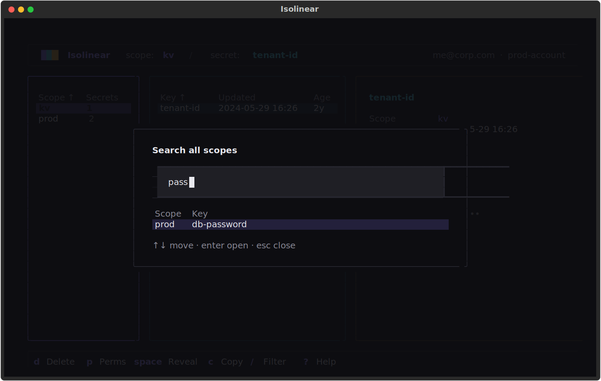
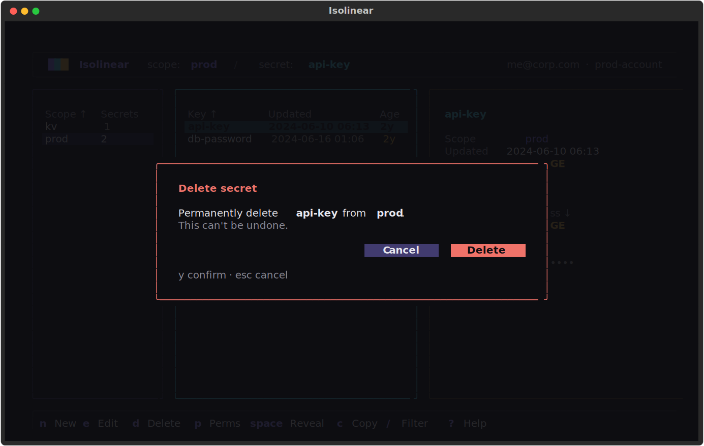
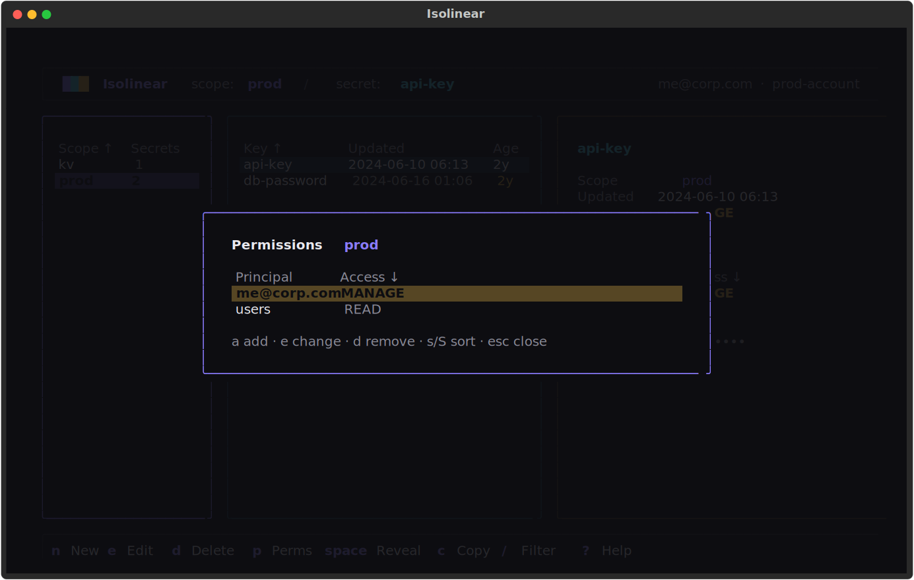
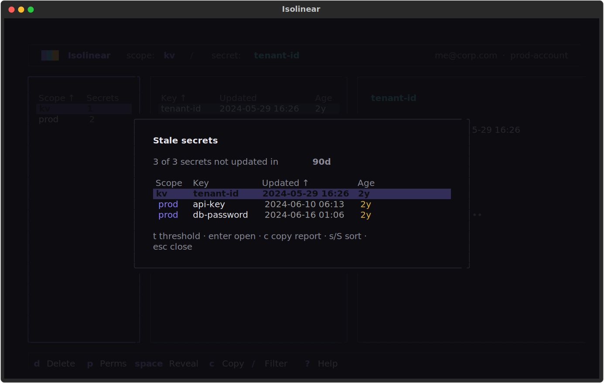

# Browsing & managing

The browser is built from three panes. The header shows a breadcrumb — `scope: X / secret: Y` — so you always know where you are.

| Pane | Shows |
|------|-------|
| **Left — scopes** | Each scope's name and secret count. |
| **Middle — secrets** | The keys in the selected scope, with last-updated and a relative age (amber when overdue for rotation). |
| **Right — detail** | Identity, your access, the scope's full ACL list, and the revealed value card. |

On startup, Isolinear pre-loads and caches scopes, secrets, and ACLs — concurrently, so even workspaces with hundreds of scopes are ready in seconds.

## Navigating

- Move within a pane with ++up++ ++down++ or ++j++ ++k++.
- Move between panes with ++left++ ++right++ / ++h++ ++l++, or ++tab++.
- Jump to the top or bottom with ++g++ / ++shift+g++.
- Selecting a scope drills into its secrets; ++enter++ on a secret reveals it.

See the [Keyboard](keyboard.md) page for the complete key table.

## Sorting and filtering

Every table is **sortable**: press ++s++ to advance to the next column (ascending), ++shift+s++ to reverse the direction, or click a column header; a ↑ / ↓ marks the active column.

Press ++slash++ to fuzzy-filter the focused pane. ++up++ ++down++ move the selection while you type, ++enter++ keeps the filter (a `⌕ query n/m` chip above the table shows it's active), and ++esc++ clears it.

## Searching everywhere

Press ++ctrl+f++ to search across **every scope** at once — fuzzy-matched on `scope/key`, served instantly from the warmed cache. ++enter++ jumps the browser straight to the secret.

## Revealing and copying values

Reveal a value with ++space++ (or ++enter++) or copy it with ++c++. Revealing shows the value in a green "live" card in the detail pane, and the value **hides itself after 30 seconds**.

Press ++shift+c++ to copy a **code reference** instead of the value — `dbutils.secrets.get(...)`, the `{{secrets/scope/key}}` Spark-conf form, or the CLI command — for pasting into notebooks and job specs.

!!! warning "Values are fetched lazily"
    Secret values are read on demand — only when you reveal or copy them — and are **never bulk-loaded**. Nothing about a value leaves Databricks until you ask for it. Copying places the value on your system clipboard; clear it if you share your machine. The *Forget revealed values* palette command purges every cached value from memory.

## Creating, editing, and deleting

- **New secret** — ++n++
- **Edit secret** — ++e++
- **Delete secret** — ++d++
- **Undo secret delete** — ++u++
- **New scope** — ++shift+n++
- **Delete scope** — ++d++ on a selected scope

Destructive actions show a confirmation dialog — confirming always takes a deliberate ++y++ — and a deleted secret can be restored with ++u++.

!!! note "Azure Key Vault-backed scopes are read-only"
    Secrets in Key Vault-backed scopes are managed in Azure, so create / edit / delete are disabled for them — revealing, copying, and ACLs still work.

## Managing permissions (ACLs)

Press ++p++ to manage a scope's permissions. From the modal you can grant, change, or remove **READ**, **WRITE**, or **MANAGE** for a principal — a user, group, or service principal. Removing a grant asks for confirmation, and warns when the grant you're revoking is your own.

!!! note "Privilege levels are colour-coded"
    Permission levels are coloured by privilege: **READ** muted, **WRITE** cyan, **MANAGE** amber and bold — so the strongest grants stand out at a glance.

## Authorization overview

Press ++a++ for a modal listing every scope with your **effective** permission and the number of principals, sorted by privilege. It's a fast "what can I touch" view across the whole workspace.

## Stale-secret audit

Press ++shift+a++ for a rotation report: every secret **not updated within the threshold**, oldest first. ++t++ cycles the window through 30 / 90 / 180 / 365 days, ++enter++ jumps to the secret in the browser, and ++c++ copies the table as markdown for a rotation ticket. Pure metadata — no values are read.

## Refreshing

- Refresh the selected scope with ++r++.
- Refresh the whole workspace with ++shift+r++.
