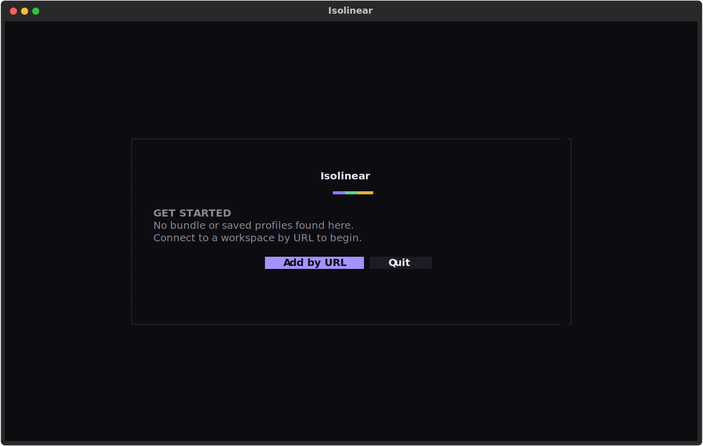

# Connecting

On launch, Isolinear opens a **workspace picker**. It gathers connection targets from three sources and labels every row with its **Source**, so you always know where a target came from.


Pick a row and press ++enter++. Saved profiles connect instantly; a bundle target or a URL opens your browser to authenticate.

!!! note "Account-level discovery was removed"
    There is no cloud + Account ID step. You connect by **profile**, **bundle**, or **URL** — nothing else.

## The three sources

### 1. Asset bundle

If a `databricks.yml` (a [Databricks Asset Bundle](https://docs.databricks.com/dev-tools/bundles/index.html)) is present in the current directory, its target workspace is offered as the **pre-selected default**.

Isolinear resolves the host as follows:

- It picks the target flagged `default: true` (or the only target, if there is just one).
- It falls back to the top-level `workspace.host`.
- Unresolved `${...}` variables are skipped, falling back to the top-level host.

A minimal bundle with `dev` and `prod` targets, where `prod` is the default:

```yaml
bundle:
  name: my-project

targets:
  dev:
    workspace:
      host: https://dev.cloud.databricks.com

  prod:
    default: true
    workspace:
      host: https://prod.cloud.databricks.com
```

!!! tip "Running inside a bundle project just works"
    Launch `isolinear` from a directory that contains a `databricks.yml` and the right workspace is already selected — just press ++enter++.

### 2. `~/.databrickscfg` profiles

Every saved profile in `~/.databrickscfg` is listed automatically. Saved profiles connect instantly, because authentication is already configured.

### 3. Workspace URL

Choose **Add by URL**, enter a workspace host, and sign in through the browser (OAuth U2M / SSO) — exactly like `databricks auth login`. This stores the `host` and `auth_type = external-browser`; it **never stores a token**.

Optionally tick **save as profile** to persist the target in `~/.databrickscfg` for next time.

!!! note "What gets written"
    Saving a URL as a profile writes only the **host** and `auth_type = external-browser`. No secret and no token is ever written to your config.

## When nothing is discovered

If there is no bundle in the current directory and no saved profiles, the picker still opens — empty — so you can add a workspace by URL.


